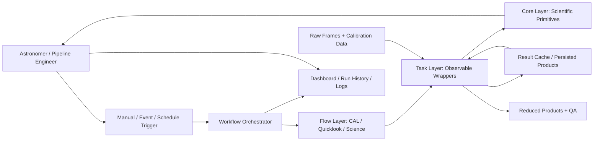
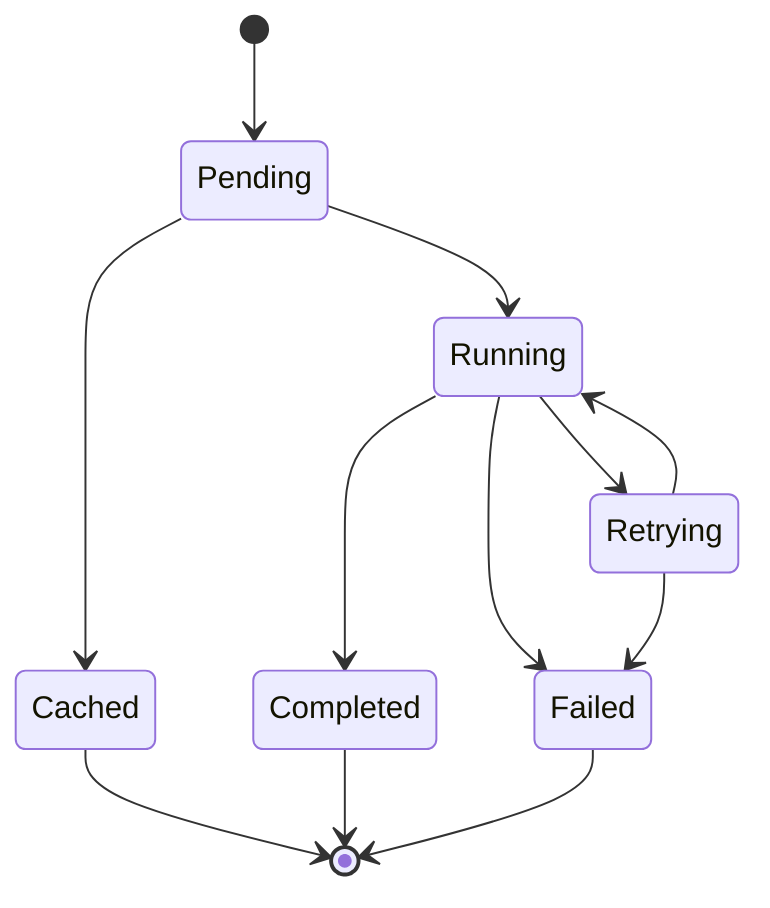

# Data Reduction Pipeline Design Guidelines

## 1. Purpose

This document defines the minimum architecture for an observatory Data Reduction Pipeline (DRP).

The goal is to provide enough structure for a DRP to be:

- **Observable**: what ran, with which parameters, how far it progressed, and what it produced are visible during and after a run.
- **Reproducible**: a reduction can be re-run and yield the same scientific result from the same inputs.
- **Selective**: a change to one step re-runs that step and its dependents, not the whole reduction.
- **Scalable**: independent work runs in parallel without changes to scientific code.
- **Expandable**: a new instrument reuses the framework rather than rebuilding it.

This specification is intentionally minimal. It defines the architectural spine that each instrument-specific pipeline should extend.

---

## 2. Scope

This specification applies to the software architecture of instrument data reduction pipelines, including:

- Scientific reduction primitives
- Calibration product generation
- Quicklook and quality-assurance reductions
- Full science reductions
- Archival reprocessing campaigns
- Pipeline execution, scheduling, and monitoring
- Intermediate product caching and persistence

This specification does not define:

- A specific reduction algorithm for any instrument
- A specific orchestration product
- A data archive or file naming standard
- A complete calibration plan for any instrument

Instrument teams are expected to extend this specification with instrument-specific primitives, calibration sequences, data models, and reduction flows.

---

## 3. Architectural Principle

A reduction shall be expressed as a directed acyclic graph (DAG) of state-aware tasks rather than as a driver script.

Each task shall own one meaningful reduction step, report its own state, log its own parameters and results, and be independently cacheable. Orchestration concerns (state tracking, caching, retries, monitoring, scheduling, parallelism) shall be provided by a general-purpose workflow orchestrator rather than built per project.

The consequence is that routine operations become inspections of state the pipeline already holds: diagnosing a failed batch, re-running a subset of steps after a parameter change, and monitoring progress require no reconstruction from log files.

---

## 4. System Context



The specific orchestrator may vary by project. The architecture requires that task state, parameters, logs, cached products, and failure context remain available regardless of the selected orchestrator.

---

## 5. Required Architectural Components

A conforming DRP design shall include the following minimum components.

### 5.1 Layer Separation

The pipeline shall be organized into three strictly separated layers.

| Layer | Contents | Prohibited |
|---|---|---|
| Core | Scientific primitives: pure functions over standard array and astronomy types | Any orchestration awareness |
| Task | Thin wrappers adding logging, caching, retry policy, and a readable name | Reduction logic |
| Flow | DAG composition and parameter plumbing | Reduction logic, direct hardware or archive access |

Imports shall cross these boundaries in one direction only. The core layer shall not import from the task layer, the flow layer, or the orchestrator. This boundary shall be enforced by an automated test so that it is a verified property of the codebase rather than a stated intention.

A core primitive shall be usable without modification in three contexts:

1. Inside a task during a pipeline run
2. Inside a notebook during interactive analysis
3. Inside a unit test during verification

This requirement is what makes an unexpected result investigable: the astronomer imports the identical function the pipeline ran, calls it on the identical inputs, and iterates on parameters interactively.

### 5.2 Task Wrappers

A task wrapper shall add exactly four things:

- Parameter logging at entry
- Summary-statistic logging at exit
- Cache configuration
- Retry policy

A wrapper that exceeds roughly twenty lines shall be treated as a design smell: the excess is reduction logic that belongs in the core layer.

Not every function becomes a task. A function shall be wrapped as a task only if it performs I/O, is computationally substantial, is a meaningful unit of caching, or produces output worth inspecting.

Over-tasking adds scheduler overhead and dashboard clutter without observability gain. Under-tasking collapses the DAG into opaque blocks and forfeits selective re-execution.

### 5.3 Flow Scoping

Each instrument's flow layer shall be organized as a triad.

| Flow | Purpose | Timing constraint |
|---|---|---|
| CAL | Build and cache master calibrations | Real time as frames arrive, or on demand |
| Quicklook | Fast, fixed-parameter reduction with QA products | Must keep pace with observing |
| Science | Full-quality reduction: optimal extraction, sky subtraction, flux calibration | None |

The triad shall be joined by the cache: master calibrations produced by the CAL flow shall be consumed by the Quicklook and Science flows as cache hits rather than being rebuilt. A master calibration shall be computed once per calibration epoch and served to every downstream reduction that needs it.

Within an instrument, a detector channel or similar configuration variant that produces an identical DAG shape shall be a flow parameter, not a separate flow.

### 5.4 Caching and Selective Re-execution

Caching shall be treated as the mechanism by which selective re-execution exists, not as a performance optimization layered onto a working pipeline.

Every cacheable task shall derive its cache key from the content of its inputs, so that "has this step already run on these inputs with these parameters" is a decidable question.

For the multi-megabyte arrays a reduction passes between steps, the cache key should be a content fingerprint (shape, dtype, and statistical moments) combined with all non-array parameters, rather than a hash of the full buffer. A fingerprint is orders of magnitude cheaper than a full hash and is robust to bit-level noise while remaining sensitive to any change that alters the data scientifically.

Where bit-exactness is required, such as differential testing of two implementations of the same primitive, full-content hashing shall be used instead.

Content-derived keys impose one obligation on the rest of the architecture: task inputs shall never be mutated. All inter-task data types shall be immutable by convention, and primitives shall return new objects rather than modifying arguments. Where an external library mutates in place, its core wrapper shall contain the mutation behind a copy-and-return form.

Immutability also provides failure isolation: concurrent per-frame chains share no mutable state, so one frame's failure leaves its neighbors untouched.

### 5.5 Canonical Data Model

The pipeline shall define a canonical internal data model and use it for every value that crosses a task boundary.

At minimum:

- Two-dimensional frames shall travel as a standard container carrying data, uncertainty, mask, and header
- Structural metadata shall travel as small frozen records, not as loose dictionaries
- Adaptation between canonical types and an external library's native types shall happen inside the core primitive, in one adapter module per library

An external library's native type shall never appear in a task signature or as a node in the DAG. This is what allows primitives sourced from different community packages to compose under one DAG with uniform observability, caching, and failure semantics.

The orchestration layer shall be primitive-source-agnostic: a task wrapper does not know or care which library the function beneath it came from, only that it satisfies the core primitive contract.

### 5.6 Observability

The pipeline's operational surface shall expose, during and after any run:

- The DAG with per-task state in real time
- Every task's parameters as logged at entry
- Every task's summary statistics as logged at exit
- Per-task log streams, so a failure reads as one task's contextualized traceback rather than a needle in an interleaved global log
- Timing per task and per run
- Cache-hit status per task
- Cached intermediate products, retrievable from past runs and exportable on request (§5.10)

Exit logs shall report scientific meaning, not merely success. A completed task shall communicate what happened (slit counts, median widths, frame medians), not only that it succeeded.

Orchestration shall live at the flow level. Tasks shall not call tasks: a group of tasks wrapped inside a parent task renders as a single opaque node and loses the inner structure. Where nesting is genuinely required, it shall be a subflow, which preserves full structure.

### 5.7 Failure Handling

The pipeline shall degrade gracefully. A failure in one frame's reduction chain shall not fail the batch.

Required failure behavior:

1. The affected unit fails visibly, with its input path, exception, and retry history surfaced in its own task state
2. The remainder of the batch completes normally and remains trustworthy
3. The run reports completion with a documented per-unit failure rather than an unrecoverable batch-level error
4. The operator can re-run only the failed unit's chain, with cached results from successful units served immediately

Retry policy shall encode the failure taxonomy:

| Task class | Retry policy | Rationale |
|---|---|---|
| I/O tasks (frame loading, result saving) | Two to three retries with backoff | Failures are frequently transient at an observatory: network filesystems, disk contention |
| Computation tasks | Zero retries | A deterministic primitive that failed once on given inputs will fail identically again; surface it immediately with full context |

### 5.8 Concurrency Model

Concurrency shall be a per-flow configuration parameter, not an implementation detail embedded in scientific code. Changing the execution model shall not require changes to any primitive, wrapper, or flow.

Guidance for selecting the model:

- I/O-bound stages are well served by thread-based concurrency
- CPU-bound stages shall use process-based execution. Threaded execution of CPU-bound Python does not merely fail to speed up, it can regress measurably against serial execution due to interpreter-lock contention
- Batch shape shall be discovered by a visible fan-out task, so that the number of units processed appears in the DAG rather than hiding inside a Python loop
- Within a unit, the chain is sequential because it is a data dependency; across units, chains are concurrent

When a threaded stage underperforms, thread oversubscription in numerical libraries and thread-safety violations shall both be ruled out explicitly before attributing the result to interpreter-lock contention.

### 5.9 Dual-Layer Primitives

Performance shall not be purchased with accessibility.

Every primitive shall have a canonical pure-Python implementation that defines correct behavior. A performance-critical primitive may additionally carry a compiled implementation, selected automatically when present.

Requirements for the dual-layer model:

- The canonical implementation registers itself as the default for a primitive name
- The compiled implementation, if importable, overrides the registry entry for that name
- Call sites are unchanged in either case; selection is internal to the core layer
- An environment override shall force the canonical path for debugging, verification, or environments where the compiled extension is unavailable
- Both implementations shall produce identical results within documented floating-point tolerances, enforced by differential tests in continuous integration that run every dual-layer primitive through both backends on identical inputs

Opting into the compiled path shall affect performance only. Nothing about correctness or usability shall depend on it.

### 5.10 Product Headers and Materialization

Every product written to disk shall record its own processing history in its FITS header.

At minimum, the header shall record:

- Pipeline version and run identifier
- The ordered list of reduction steps applied, with the key parameters each was called with
- The input frames and calibration products consumed

A structured, machine-readable convention (one keyword per applied step) is preferred over free-form `HISTORY` cards, so that a directory of products can be queried for what was done to them.

This is a secondary visibility layer, and the architecture shall not depend on it. The orchestrator's task state and the content-derived cache keys of §5.4 remain the authoritative record of what has run. A pipeline shall never parse a product header to decide whether a step is needed, which step to run next, or whether a cached result is valid. The header answers "what was done to this file" for a human or an external tool holding the file alone, without access to the run.

Intermediate products live in the result cache. FITS serialization of an intermediate product shall happen only when a download or export is requested, not as a side effect of every step. Final science products are written as a matter of course.

The consequence is that the same provenance information exists in two independent places, arrived at by different means: the orchestrator holds it as run state, and each exported file carries it inline. Where the two disagree, the run state is correct and the discrepancy is a bug in header writing.

---

## 6. Task Contract

All tasks shall follow a common structural contract.

### 6.1 Minimum Entry Log Fields

```text
task_name
input_fingerprints
parameters
cache_key
```

### 6.2 Minimum Exit Log Fields

```text
task_name
final_state
duration
cache_hit
summary_statistics
```

### 6.3 Minimum Failure Fields

```text
task_name
input_identifier
exception_type
exception_message
traceback
retry_count
```

### 6.4 Run Identifier Requirement

Every run shall have a unique identifier that correlates task states, logs, parameters, cached products, and produced files.

A reduction shall not produce a data product that cannot be traced back to the run, the parameters, and the input frames that generated it.

---

## 7. Required State Models

### 7.1 Task Lifecycle

A task shall follow an explicit lifecycle.



Minimum task states:

| State | Meaning |
|---|---|
| `pending` | Task is scheduled but has not started. |
| `running` | Task is actively executing. |
| `cached` | Task was satisfied from a prior result with a matching cache key. |
| `retrying` | Task failed and is being retried under its retry policy. |
| `completed` | Task completed successfully. |
| `failed` | Task exhausted its retry policy without completing. |

Instrument teams may add additional states, but they shall preserve these minimum lifecycle concepts.

### 7.2 Run Lifecycle

A run shall report a state distinct from the states of its tasks. A run containing a documented per-unit failure that otherwise completed its batch shall not be reported identically to a run that failed as a whole.

---

## 8. Reproducibility Requirements

The pipeline shall make a reduction reproducible from recorded state.

At minimum:

- All top-level dependencies shall be pinned and the repository shall carry a lockfile
- Reduction parameters shall be configuration data, not values embedded in code
- Every task's parameters shall be recorded as executed, not as defaulted
- Intermediate products shall be cached and retrievable from past runs, and exported products shall carry their processing history in their headers (§5.10)
- Cache keys shall be derived from input content, so that a cache hit means the inputs are scientifically identical to a previous run, not merely that a filename matched

A provenance layer above the DAG, capable of identifying and re-running the reductions that consumed a superseded calibration product, is a recommended extension. It shall be designed as an addition to this architecture, not a replacement for the caching model.

---

## 9. Testing Requirements

The pipeline shall be testable without instrument hardware and without a full data set.

At minimum:

- A static test shall fail if the core layer imports from the task layer, the flow layer, or the orchestrator
- Core primitives shall be unit-testable as plain functions
- Dual-layer primitives shall carry differential tests across both backends using full-content comparison
- Flows shall be runnable against a small fixture data set

Pipelines shall be validated against raw instrument output, not only against pre-assembled data. Synthetic frames that are already assembled and already oriented conceal a real reduction stage: raw frames arrive with overscan regions, multi-amplifier structure, and an orientation that downstream primitives may not expect. Raw-image assembly and orientation are first-class reduction stages, and a pipeline validated only on synthetic data should expect additional integration work when first applied to real frames.

The manual path shall remain viable. Automation adds its own complexity and failure modes, and the mitigation is that every core primitive remains runnable by hand in a notebook.

---

## 10. Minimum Viable Implementation

A practical minimum implementation should start with one vertical slice.

```text
trigger
  -> one flow
  -> fan-out over input frames
  -> per-frame chain of three or four tasks
  -> cached master calibration from a CAL subflow
  -> persisted products
  -> dashboard
```

A recommended first implementation includes:

1. The three-layer directory structure and its import-boundary test
2. Three or four core primitives, at least one sourced from a community package through an adapter
3. The canonical data model for frames and structural metadata
4. The task-wrapper pattern with content-fingerprint caching
5. A CAL subflow producing one cached master calibration
6. A Quicklook flow consuming it
7. A batch run with one deliberately corrupt input, to verify failure isolation

This validates the architecture before expanding it to the full instrument.

---

## 11. Instrument-Specific Expansion Points

Each instrument team shall extend this minimum specification with details specific to the instrument.

### 11.1 Primitive Inventory

Define each primitive, its source, the canonical types it consumes and returns, and whether it carries a compiled backend.

| Primitive | Source | Types in / out | Dual-layer | Notes |
|---|---|---|---|---|
| Raw frame assembly | Instrument-specific | Raw HDU list / frame | No | Overscan, multi-amplifier, orientation |
| Master bias combination | Community package | Frame list / frame | Candidate | Median combination over a bias stack |
| Slit tracing | Community package | Frame / slit edge record | No | Wrapped through an array-level adapter |
| Cosmic-ray rejection | Community package | Frame / frame | Yes | Dominates wall-clock time |

Where a primitive's types are instrument-specific structural records, define them alongside this table. Where it wraps an external library, name the adapter module that converts to and from that library's native types.

### 11.2 Calibration Structure

Define calibration epochs, the products built per epoch, and their cache lifetimes.

### 11.3 Flow Catalog

Define each flow using a consistent template:

```text
Flow name:
Purpose:
Parameters:
Input discovery:
DAG shape:
Cached products consumed:
Products produced:
Concurrency model:
Timing requirement:
Failure behavior:
```

### 11.4 Quality Assurance Products

Define the QA outputs each flow produces and the summary statistics each task logs at exit.

---

## 12. Design Rules

The following rules should guide implementation decisions.

| Rule | Rationale |
|---|---|
| Scientific code has no orchestration awareness. | Keeps primitives runnable in a notebook, a test, and a pipeline. |
| Task wrappers stay thin. | Excess wrapper logic is reduction logic in the wrong layer. |
| Tasks never call tasks. | Nesting collapses the DAG into opaque nodes. |
| Inter-task data is immutable. | Content-derived cache keys require inputs that never change under them. |
| Cache keys derive from input content. | Makes selective re-execution decidable rather than assumed. |
| Concurrency is a flow parameter. | Lets the execution model change without touching scientific code. |
| External library types stay inside primitives. | Lets primitives from multiple sources compose under one DAG. |
| Every primitive has a readable Python implementation. | Compiled acceleration must not cost accessibility. |
| Reduction parameters are configuration data. | Enables review, versioning, and reproducibility. |
| Product headers record provenance but never drive control flow. | Gives a file inspectable history without making header parsing load-bearing. |
| Failures are isolated and documented, not fatal to the batch. | One bad frame should not invalidate a night. |

---

## 13. Anti-Patterns

The following patterns should be avoided:

```text
driver script with manual state tracking
hand-built caching and resume logic
reduction logic inside task wrappers
tasks wrapped inside tasks
in-place mutation of frames between steps
external library types in task signatures
cache keys derived from filenames or timestamps
pipeline control flow driven by parsing product headers
intermediate FITS written to disk as a side effect of every step
products written with no record of what produced them
diagnosis by grepping an interleaved global log
parameters recorded only as code defaults
one bad frame failing the whole batch
compiled-only primitives with no readable reference
thread-based parallelism for CPU-bound stages
validation only against synthetic pre-assembled data
```

These shortcuts may appear faster early in development, but they make the DRP harder to operate, diagnose, reproduce, and extend.

---

## 14. Notes on Scale

The DAG-of-tasks abstraction is proven at survey scale on purpose-built middleware. This specification addresses the complementary case: obtaining the same properties at instrument scale, at an operational footprint proportionate to a team of a few engineers.

Two consequences follow for teams applying these guidelines:

- The orchestration deployment should be a server process and a worker, not a platform. Where a heavier deployment is warranted by pipeline count rather than pipeline complexity, that is a separate decision.
- Orchestration overhead per task is negligible against a multi-second reduction step and material against a microsecond array operation. This is why the task granularity rule of §5.2 exists: the architecture works because most functions are not tasks.

---

## 15. Summary

This specification defines the minimum architecture needed for an observable, reproducible, selectively re-executable, and expandable observatory Data Reduction Pipeline.

The minimum architecture is not a large framework. It is a disciplined layering:

> Pure scientific primitives below, thin observable task wrappers above, flows scoped per instrument as a CAL/Quicklook/Science triad joined by cross-flow caching, and a canonical data model that lets primitives from any source compose under one DAG.

Instrument-specific implementations should extend this specification by adding concrete primitives, calibration structures, data model records, flows, and quality assurance products.
