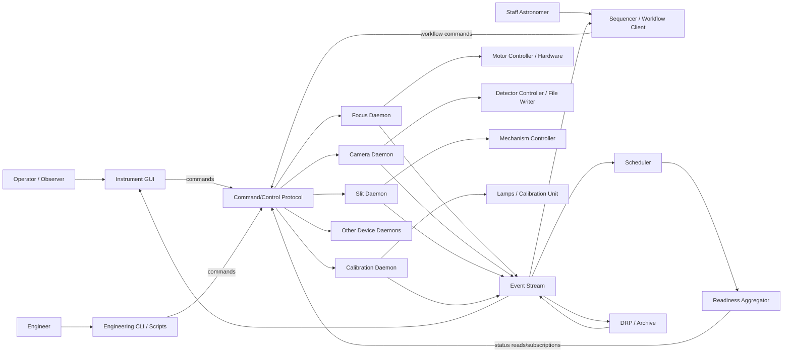
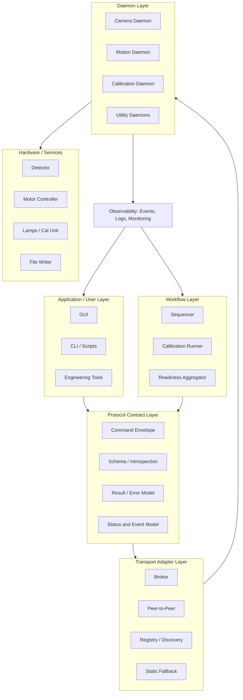
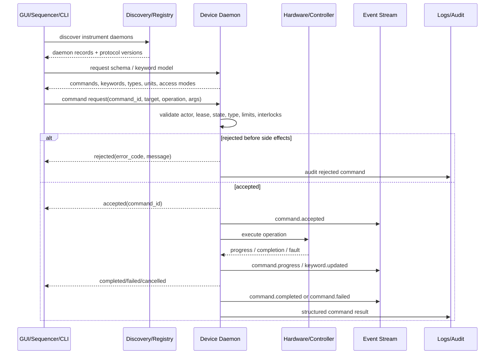
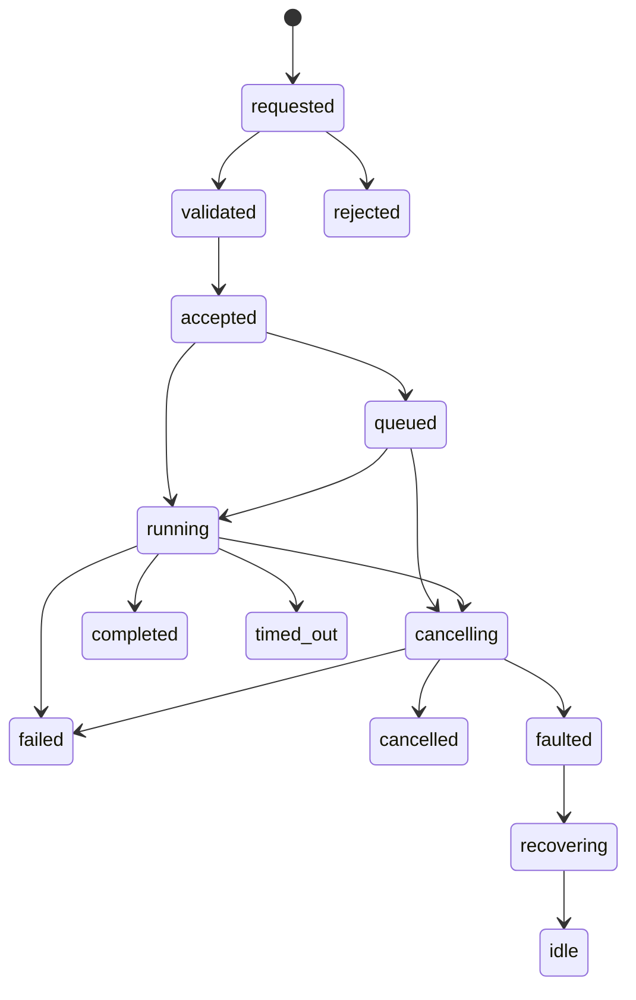
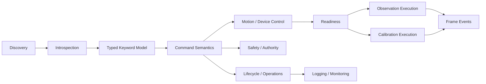

# Architecture for Observatory Instrument Command and Control

## Table of Contents

- [1. Purpose](#1-purpose)
- [2. Architectural Goal](#2-architectural-goal)
- [3. System Context and Actors](#3-system-context-and-actors)
- [4. Command-and-Control Architecture](#4-command-and-control-architecture)
- [5. Core Control Flow](#5-core-control-flow)
- [6. Protocol and Command Contract](#6-protocol-and-command-contract)
- [7. State, Readiness, and Events](#7-state-readiness-and-events)
- [8. Use Case Architecture](#8-use-case-architecture)
- [9. Detailed Operational Workflows](#9-detailed-operational-workflows)
- [10. Acceptance Criteria](#10-acceptance-criteria)
- [11. Open Architecture Decisions](#11-open-architecture-decisions)
- [12. Implementation Roadmap](#12-implementation-roadmap)
- [Appendix A. Full Use Case Catalog](#appendix-a-full-use-case-catalog)
- [Appendix B. Source Story Summary](#appendix-b-source-story-summary)

## 1. Purpose

This architecture defines how observatory instrument software should support command and control across GUIs, sequencers, engineering tools, device daemons, monitoring, calibration workflows, and data-event consumers.

The design is centered on instrument control rather than science reduction algorithms. It covers how commands are expressed, validated, executed, tracked, cancelled, logged, and observed. It also covers how multiple software clients can safely interact with the same set of device daemons without relying on a single mandatory orchestration daemon.

### Scope

- Device and subsystem daemon command interfaces
- Runtime discovery and introspection
- Typed keyword reads/writes and aggregate configuration
- Long-running command lifecycle and progress reporting
- Motion control, exposure control, calibration control, and readiness
- Event publication for status, command results, and frame-written notifications
- Safety, role control, ownership, leases, and operational recovery
- Daemon lifecycle, deployment metadata, monitoring, and logging

### Out of scope

- Detailed implementation of detector controllers, motor controllers, or telescope control internals
- Science data reduction algorithms
- A specific transport implementation, except where transport behavior affects command/control semantics

## 2. Architectural Goal

The command-and-control architecture should be a transport-agnostic protocol contract implemented by locally authoritative device daemons, with optional higher-level workflow coordination by GUIs, CLIs, sequencers, and schedulers.

This means the following:

- A GUI or sequencer may command daemons directly.
- A sequencer may coordinate multi-device workflows, but it should not be the only place where safety is enforced.
- Every daemon must validate its own commands, publish its own state, and reject unsafe or invalid requests.
- Status/event publication must be independent of command replies so that operators, schedulers, and diagnostics tools can all observe the same truth.
- Multi-client control must be explicit: many clients may read, but write operations need authority rules, leases, arbitration, or clearly documented conflict handling.

### Architecture drivers

| Driver | Architectural Consequence |
| --- | --- |
| Transport independence | The protocol envelope should not assume Zyre, MQTT, a broker, or a static registry. A client should be able to swap transport adapters without changing command semantics. |
| Daemon-local authority | Each daemon owns validation for its hardware, safety state, commandability, and final success/failure result. |
| Status is not a command reply | Command replies tell whether a command was accepted or completed. Status/events describe the evolving truth of the device and must be observable independently. |
| Explicit async semantics | Long-running actions must expose command_id, progress, terminal result, timeout behavior, and cancellation behavior. |
| Many readers, controlled writers | GUIs, schedulers, DRP/archive, and monitoring tools can observe. Writes need roles, leases, arbitration, or another explicit policy. |
| Readiness is explainable | Ready/not-ready is not enough. The system must publish why it is blocked, which daemon is responsible, and how stale the inputs are. |
| Safety beats convenience | Emergency halt and safe-state behavior must be available even when normal command ownership or queues are contested. |

## 3. System Context and Actors

The architecture assumes a distributed instrument-control environment with multiple independently running daemons. The GUI is not the only client, and there may not be a single central orchestration daemon.



### Actor summary

| Actor | Primary Need |
| --- | --- |
| Operator / observer | Know whether the instrument is ready, start/stop observations, and see clear failure reasons. |
| Engineer | Move devices, inspect daemon state, tune controller parameters, test with simulation, and debug failures. |
| Staff astronomer | Run reproducible observing and calibration workflows. |
| Sequencer / workflow client | Coordinate multiple daemons while preserving daemon-local authority and safety checks. |
| Scheduler | Read readiness and current configuration for planning future observation blocks. |
| DRP / archive | Receive durable frame-written events with metadata so reduction/archive processing does not poll disk. |
| Sysadmin | Start, stop, monitor, configure, and recover daemons using standard operations tooling. |
| Device daemon | Own hardware state, validate commands, execute actions, publish status/events, and recover safely. |

## 4. Command-and-Control Architecture

The system should be understood as layered control planes rather than a single monolithic controller.

| Layer | Examples | Responsibility |
| --- | --- | --- |
| Application / user layer | GUI, CLI, scripts, engineering tools | Present controls, request commands, display status, and avoid exposing invalid actions where possible. |
| Workflow layer | Sequencer, calibration runner, readiness aggregator | Coordinate multiple daemons, apply recipes/presets, track overall progress, and compute aggregate readiness. |
| Protocol contract layer | libby command envelope, schema model, event model | Define common request/result/status/error semantics independent of transport. |
| Transport adapter layer | Broker, peer-to-peer network, registry, static fallback | Move messages between clients and daemons without changing command meaning. |
| Daemon layer | camera daemon, focus daemon, slit daemon, lamp daemon | Validate commands, own hardware state, execute operations, publish status, expose schema, and enforce safety. |
| Hardware / service layer | motor controller, detector controller, file writer, calibration lamps | Perform the physical or service operation under daemon control. |
| Observability layer | event stream, structured logs, monitoring endpoint | Expose health, status, command progress, audit trail, and operational diagnostics. |



### Key architectural rule

A workflow client may coordinate commands, but a daemon must remain the final authority for whether its own command is safe, valid, executable, complete, failed, or faulted.

## 5. Core Control Flow

The architecture should make the normal command path explicit. A typical command begins with discovery and schema introspection, proceeds through validation and command acceptance, then produces progress, terminal results, status updates, and audit logs.



### Control flow requirements

- Every command has a stable `command_id` for correlation, retries, progress, logs, and final result lookup.
- Validation failure before side effects must be reported as `rejected`, not as an ambiguous timeout.
- Acceptance does not necessarily mean completion; it means the daemon owns the command.
- Long-running commands must emit progress or at least a visible wait reason.
- Client wait timeout must not imply the hardware stopped; clients must be able to query final command/device state.
- Status and telemetry must include timestamps and quality/staleness information.
- Emergency halt/cancel must have a clearly defined relationship to queues, leases, and roles.

## 6. Protocol and Command Contract

The protocol contract is the architecture boundary between clients, transports, and daemons. It should define message shape and semantics, not just convenience APIs like `get` and `set`.

### Command request shape

A command request should carry at least:

```yaml
protocol_version: "1.0"
message_type: request
command_id: "uuid-or-stable-id"
correlation_id: "observation-or-workflow-id"
actor:
  id: "operator_gui"
  role: "operator"
target:
  daemon_id: "focusd"
  namespace: "axis.z"
operation: "move_abs"
arguments:
  target: 12.3
  units: "mm"
blocking: false
timeout_ms: 30000
lease_id: "optional-write-lease"
validate_only: false
```

### Contract field catalog

#### Command Request

| Field | Required? | Type | Description | Example / Notes |
| --- | --- | --- | --- | --- |
| protocol_version | Yes | string | Protocol/schema version used by client. | 1.0 |
| message_type | Yes | enum | request, response, event, status, error. | request |
| command_id | Yes | uuid/string | Stable ID for correlation, idempotency, progress, and logs. | move-20260505-001 |
| correlation_id | Recommended | uuid/string | Groups multiple commands into one workflow/observation. | obsblock-123 |
| actor | Recommended | object/string | Requester identity or process context for audit/authorization. | operator_gui, sequencerd |
| target | Yes | object | Daemon, namespace, keyword, axis, or subsystem target. | focusd.axis.z |
| operation | Yes | string | Command or keyword operation name. | move_abs, write_keyword, expose |
| arguments | Yes | object | Typed parameters validated by daemon schema. | {"target": 12.3, "units": "mm"} |
| blocking | Yes | bool | Whether caller waits for terminal result or returns after acceptance. | false |
| timeout_ms | Yes | int | Client-visible timeout/deadline; may differ from device execution timeout. | 30000 |
| lease_id | When used | string | Proof of command ownership/arbitration. | lease-abc |
| validate_only | Optional | bool | Validate command/configuration without side effects. | true |

#### Command Result

| Field | Required? | Type | Description | Example / Notes |
| --- | --- | --- | --- | --- |
| state | Yes | enum | Terminal or intermediate command state. | accepted, running, completed, failed |
| result_code | Yes | enum/string | Machine-readable result/failure code. | OUT_OF_RANGE, OK |
| result_message | Yes | string | Human-readable result/failure message. | Target 80 mm exceeds soft limit 50 mm. |
| started_at | Recommended | timestamp | Command execution start time. | 46147.875 |
| updated_at | Yes | timestamp | Last result/progress update time. | 46147.87505787037 |
| completed_at | For terminal | timestamp/null | Completion/failure/cancel time. | 46147.87511574074 |
| progress | Optional | object | Current step, percent, or wait reason. | {"step":"settling","pct":80} |
| final_state | Recommended | object | Relevant final daemon/device state snapshot. | position, in_position, readiness |

#### Status Event

| Field | Required? | Type | Description | Example / Notes |
| --- | --- | --- | --- | --- |
| event_id | Yes | string | Unique event identifier for dedupe/replay. | evt-123 |
| event_type | Yes | string | Semantic event name. | motion.completed, frame.written |
| daemon_id | Yes | string | Publishing daemon. | focusd |
| timestamp | Yes | timestamp | Event creation time. | UTC preferred |
| sequence | Recommended | int | Monotonic per-publisher sequence number. | 12402 |
| quality | Recommended | enum | valid, stale, invalid, simulated, degraded. | valid |
| payload | Yes | object | Event-specific typed payload. | position update, frame metadata |
| replayable | Recommended | bool | Whether consumers can request missed event later. | true for frame events |

#### Error Model

| Field | Required? | Type | Description | Example / Notes |
| --- | --- | --- | --- | --- |
| error_code | Yes | enum/string | Stable machine-readable error code. | PERMISSION_DENIED |
| severity | Recommended | enum | info, warning, error, fault, emergency. | fault |
| recoverability | Recommended | enum | retryable, operator_ack, rehome_required, service_restart_required. | operator_ack |
| safe_state | Recommended | string/object | State reached or required after error. | motion stopped; position unknown |
| details | Optional | object | Structured extra diagnostic details. | controller status, raw vendor code |

## 7. State, Readiness, and Events

Command and control becomes reliable only when the system distinguishes command lifecycle, daemon/device readiness, and event publication. These are related but not the same.

### Command lifecycle



| State | Meaning | Publisher | Terminal? | Allowed Next States | Operator Meaning |
| --- | --- | --- | --- | --- | --- |
| requested | Client has created/submitted a command. | Client | No | validated, rejected | Command was sent but not yet accepted. |
| validated | Daemon accepted schema/types/preconditions. | Daemon | No | accepted, rejected | Request is well formed and allowable so far. |
| rejected | Daemon refused before execution. | Daemon | Yes | none | Nothing should have changed. |
| accepted | Daemon owns the command. | Daemon | No | queued, running, cancelling, failed | Command landed. |
| queued | Waiting for resource/lease/prior command. | Daemon | No | running, cancelling, timed_out, failed | Not yet moving/acting. |
| running | Actively executing. | Daemon | No | completed, failed, cancelling, timed_out | Action in progress. |
| cancelling | Cancel/halt requested. | Daemon | No | cancelled, failed, faulted | Trying to stop safely. |
| completed | Successful terminal result. | Daemon | Yes | none | Done. |
| failed | Unsuccessful but daemon may still be usable. | Daemon | Yes | none | Command failed. |
| timed_out | Deadline exceeded. | Daemon or Client | Yes | none | Unknown or failed due timeout. |
| cancelled | Command stopped before success. | Daemon | Yes | none | Cancelled safely. |
| faulted | Device/daemon fault requiring recovery. | Daemon | Conditionally | recovering, offline, idle | Needs intervention or recovery. |

### Daemon and instrument readiness states

Readiness is mode-specific. A daemon may be alive and idle but not ready for a science exposure. The readiness model must also expose why a state is blocked.

| State | Meaning | Commandable? | Typical Cause | Required Telemetry | Blocks Observing? |
| --- | --- | --- | --- | --- | --- |
| offline | No active daemon/connection. | No | Process down or unreachable. | last_seen, endpoint | Yes |
| initializing | Daemon starting or hardware initializing. | Limited | Startup, reconnect, homing. | startup_state, config_validation | Yes |
| idle | Daemon is alive and not busy. | Yes | Normal available state. | health, current config | Depends |
| configuring | Applying settings or moving mechanisms. | No or limited | Preset/config command running. | current_step, command_id | Yes |
| ready | Ready for requested mode. | Yes | Config validated and in-position. | config_hash, readiness timestamp | No |
| exposing | Exposure active/readout pending. | Limited | Camera exposure or observation active. | exposure_state, remaining_time | Usually |
| blocked | Known condition prevents operation. | No | Stale state, safety interlock, missing daemon. | wait_reason, blocking_daemon | Yes |
| fault | Fault requiring recovery. | No | Controller error, unknown position. | fault_code, recoverability | Yes |
| maintenance | Engineer-only mode. | Limited by role | Manual tuning, low-level access. | actor, lock/lease | Yes |
| simulation | Daemon is simulated. | Yes in test | Development/CI/offline test. | simulated=true | Production: Yes |

### Core event catalog

Events are the shared observation channel for GUIs, sequencers, schedulers, DRP/archive systems, and monitoring. Some events are ephemeral; others, especially `frame.written`, need durable or replayable delivery.

| Event Type | Category | Publisher | When Emitted | Minimum Payload | Durable / Replay? | Consumer |
| --- | --- | --- | --- | --- | --- | --- |
| daemon.discovered | lifecycle | discovery/daemon | Daemon is visible. | daemon_id, endpoint, version, capability_hash | No | GUI, sequencer |
| daemon.heartbeat.stale | health | monitor/aggregator | Heartbeat exceeds policy. | daemon_id, age, policy | No | GUI, scheduler |
| schema.changed | introspection | daemon | Keyword/command schema changes. | daemon_id, old_hash, new_hash | No | GUI, clients |
| keyword.updated | status | daemon | Keyword/status field changes. | daemon_id, keyword, value, timestamp, quality | Optional | GUI, scheduler |
| command.accepted | command | daemon | Command accepted for execution. | command_id, operation, target, actor | Recommended | client, logs |
| command.progress | command | daemon | Command changes step/progress. | command_id, state, progress, wait_reason | Optional | GUI, sequencer |
| command.completed | command | daemon | Command succeeds. | command_id, result_code, final_state | Recommended | client, logs |
| command.failed | command | daemon | Command fails. | command_id, error_code, recoverability | Recommended | client, logs |
| motion.position.updated | motion | mechanism daemon | Position changes during motion. | axis, position, target, moving, timestamp | No | GUI, sequencer |
| motion.halted | motion | mechanism daemon | Axis stop/halt executed. | axis, reason, position_confidence | Recommended | operator, safety |
| instrument.readiness.changed | readiness | aggregator/workflow | Aggregate readiness changes. | instrument_id, state, blocker, stale_fields | Recommended | operator, scheduler |
| frame.written | data event | camera/file daemon | Frame write and metadata complete. | frame_id, path, metadata, checksum optional | Yes | DRP, archive |
| cal.step.completed | calibration | sequencer/workflow | Calibration recipe step complete. | recipe_id, step_id, frame_id/result | Recommended | operator, DRP |
| authz.denied | security | daemon | Write command denied by policy. | actor, command, reason, policy_version | Recommended | sysadmin, audit |

## 8. Use Case Architecture

The use cases are grouped by the architectural capability they drive. The early groups define the protocol foundation; the later groups define operational behavior and observability.

| Area | Use Cases |
| --- | --- |
| Discovery & Connectivity | 3 |
| Introspection & Metadata | 2 |
| Keyword Read/Write | 5 |
| Command Semantics | 4 |
| Motion Control | 4 |
| Controller / Engineering | 1 |
| Instrument Setup | 3 |
| Observation Execution | 3 |
| Calibration | 3 |
| Frame Events | 2 |
| Lifecycle & Operations | 5 |
| Logging & Diagnostics | 3 |
| Authority & Safety | 2 |
| Simulation & Testing | 1 |
| Protocol / Packaging | 1 |

### Capability flow



### Architecture-significant use cases

| ID | Use Case | Architectural Decision It Drives | Priority |
| --- | --- | --- | --- |
| UC-001 | Discover active daemons in an instrument | Design discovery as a service contract, not a transport assumption. Support broker, registry, P2P, and static fallback. | Must have |
| UC-004 | Introspect daemon keyword model | This is central to libby adoption. Treat describe()/schema as a first-class API. | Must have |
| UC-007 | Write strongly typed keyword | Keyword writes should behave like commands when they initiate hardware actions. | Must have |
| UC-011 | Run blocking or non-blocking command | Do not make GUI block on hardware motion unless explicitly requested. | Must have |
| UC-013 | Cancel or halt in-flight operation | Distinguish cancel sequence, halt motion, and emergency stop. They are not the same operationally. | Must have |
| UC-015 | Move stage absolute or relative | Provide absolute and relative moves but normalize into one internal motion command model. | Must have |
| UC-020 | Apply named instrument preset | This can live in a sequencer/workflow layer while device daemons remain authoritative for local safety. | Must have |
| UC-021 | Report aggregate instrument readiness | Recommended states: offline, initializing, idle, configuring, ready, exposing, blocked, error, maintenance. | Must have |
| UC-023 | Start exposure | Even if camera is outside libby scope initially, command model should support exposure-like long operations. | Must have |
| UC-024 | Abort exposure or sequence | Define abort scope clearly so operator controls are predictable. | Must have |
| UC-026 | Run reproducible calibration sequence | Recipes should be versioned so nightly calibration can be reproduced. | Must have |
| UC-029 | Publish new-frame-written event | Downstream consumers should never need to poll disk to discover normal frames. | Must have |
| UC-033 | Graceful shutdown with in-flight command handling | This should be a daemon state, not just process exit behavior. | Must have |
| UC-034 | Recover from transient hardware disconnect | Differentiate communications recovery from mechanical state recovery. | Must have |
| UC-039 | Control write access by role | Final enforcement belongs near the daemon/device, not only in the GUI. | Nice to have |
| UC-040 | Prevent conflicting commands with leases or arbitration | This is especially important in a peer-to-peer architecture without a single orchestration daemon. | Must have |
| UC-041 | Run daemon in simulation mode | Simulation mode should use the same client API as hardware mode. | Nice to have |
| UC-042 | Use libby as installable transport-agnostic Python package | This is a platform requirement rather than an observing workflow, but it affects every use case. | Must have |

## 9. Detailed Operational Workflows

These workflows describe the behavior expected from the architecture. They should be used to derive protocol tests, daemon behavior tests, GUI behavior, and operator-facing status displays.

### UC-001 — Discover active daemons

**Actors:** GUI, sequencer, discovery service, daemons

**Preconditions:** Daemons are configured with stable IDs and advertise capabilities.

**Nominal flow:**

1. Client requests daemons for instrument.
2. Discovery returns daemon records.
3. Client filters by protocol compatibility.
4. Client subscribes to daemon lifecycle events.
5. Client builds control/status model from discovered daemons.

**Alternate / failure flows:** No daemon returns; duplicate ID found; incompatible protocol; advertised endpoint is stale.

**Recovery / safe state:** Retry discovery; use static fallback; mark incompatible daemon read-only or unavailable.

**Telemetry & events:** `daemon.discovered, daemon.lost, daemon.changed, last_seen, protocol_version`

**Acceptance criteria:** Client can discover daemon list without static GUI config; incompatible daemons are visible but not commandable.

### UC-004 — Introspect keyword model

**Actors:** GUI, engineer, daemon

**Preconditions:** Daemon exposes schema describing keywords, commands, events, units, access, and types.

**Nominal flow:**

1. Client requests schema.
2. Daemon returns schema version and keyword metadata.
3. Client validates supported types.
4. GUI builds controls for writable keywords and displays read-only status.
5. Client caches schema by capability_hash.

**Alternate / failure flows:** Schema is missing fields; schema version unsupported; keyword uses unknown type.

**Recovery / safe state:** Reject writes to unknown schema; show partial metadata; require daemon fix before operations.

**Telemetry & events:** `schema.published, schema.changed, keyword metadata timestamps`

**Acceptance criteria:** Every keyword has name, type, access, description, timestamp policy, and units or explicit unitless marker.

### UC-007 — Write strongly typed keyword

**Actors:** Client, daemon, keyword validator

**Preconditions:** Caller has write role; keyword is writable; daemon is in a state that accepts the write.

**Nominal flow:**

1. Client sends typed value with command_id.
2. Daemon validates actor, type, range, enum, and current state.
3. Daemon rejects or accepts.
4. If write triggers action, daemon publishes command progress.
5. Daemon publishes final value/result.

**Alternate / failure flows:** Type mismatch; read-only field; permission denied; hardware rejects action.

**Recovery / safe state:** Reject before side effects when possible; include machine code and human message; preserve prior value.

**Telemetry & events:** `keyword.write.requested, command.accepted, command.completed, keyword.updated`

**Acceptance criteria:** Invalid writes never silently coerce types; every write receives accepted/rejected/final result.

### UC-008 — Atomic aggregate configuration

**Actors:** Sequencer, daemon, validator

**Preconditions:** All related keywords belong to a defined aggregate or transaction.

**Nominal flow:**

1. Client sends aggregate map with validate_only=false.
2. Daemon validates all fields together.
3. Daemon reserves device/configuration.
4. Daemon applies settings in safe order.
5. Daemon publishes final config hash.

**Alternate / failure flows:** One field invalid; hardware accepts partial settings then fails; timeout during apply.

**Recovery / safe state:** Validate before apply; rollback where safe; otherwise declare partial/unknown state and block readiness.

**Telemetry & events:** `aggregate.write.validated, aggregate.write.applied, aggregate.write.failed`

**Acceptance criteria:** Daemon never reports ready for a partially-applied config without an explicit degraded/partial state.

### UC-011 — Blocking/non-blocking command

**Actors:** GUI, script, daemon

**Preconditions:** Command schema includes blocking flag, timeout, and command_id.

**Nominal flow:**

1. Client sends command.
2. Daemon validates and accepts.
3. If non-blocking, daemon immediately returns command_id.
4. Daemon publishes running/progress.
5. Client waits, polls, or subscribes for final result.

**Alternate / failure flows:** Client disconnects; daemon restarts; result event lost; duplicate command_id.

**Recovery / safe state:** Store recent command result; allow command status query; mark unknown after restart if state cannot be reconstructed.

**Telemetry & events:** `command.accepted, command.progress, command.result`

**Acceptance criteria:** A non-blocking command never requires the client request channel to remain open to complete safely.

### UC-013 — Cancel/halt command

**Actors:** Operator, safety monitor, daemon

**Preconditions:** A command is in-flight, or an axis/exposure can be halted.

**Nominal flow:**

1. Actor requests cancel or halt.
2. Daemon prioritizes safety over queue order.
3. Daemon transitions to cancelling/halted.
4. Device stops or reaches safe point.
5. Daemon publishes final cancelled/failed/faulted state.

**Alternate / failure flows:** Operation cannot be cancelled; device does not acknowledge stop; state becomes uncertain.

**Recovery / safe state:** Escalate to emergency stop if available; block new commands; require re-home or operator acknowledgement if uncertain.

**Telemetry & events:** `command.cancel.requested, motion.halted, daemon.faulted`

**Acceptance criteria:** Emergency halt can be issued even if another actor holds the normal command lease.

### UC-015 — Move stage absolute/relative

**Actors:** Engineer, sequencer, mechanism daemon

**Preconditions:** Axis initialized or homed; target/offset within limits; no conflicting motion.

**Nominal flow:**

1. Client sends move command.
2. Daemon converts relative offset to target if needed.
3. Daemon validates target, limits, interlocks.
4. Controller begins move.
5. Daemon publishes position and motion state.
6. Daemon completes when settled/in-position.

**Alternate / failure flows:** Out-of-range target; timeout; controller fault; encoder mismatch; limit triggered.

**Recovery / safe state:** Stop or hold; publish last known position and confidence; require clear/retry or homing.

**Telemetry & events:** `motion.started, motion.position.updated, motion.settled, motion.completed`

**Acceptance criteria:** Accepted command is not treated as complete until the daemon reports in-position/settled or failed.

### UC-016 — Home axis

**Actors:** Engineer, operator, mechanism daemon

**Preconditions:** It is safe to move the axis through homing travel.

**Nominal flow:**

1. Client sends home command.
2. Daemon validates homing is permitted.
3. Axis moves according to homing profile.
4. Daemon detects home/reference.
5. Daemon sets position and position_confidence=known.

**Alternate / failure flows:** Home switch not found; limit fault; timeout; disconnect mid-home.

**Recovery / safe state:** Stop; set position_confidence=unknown; block automated moves until acknowledged or rehomed.

**Telemetry & events:** `motion.homing.started, motion.homing.completed, motion.homing.failed`

**Acceptance criteria:** After successful home, position, units, and confidence are updated together.

### UC-020 — Apply named instrument preset

**Actors:** Operator, sequencer, device daemons

**Preconditions:** Preset exists; daemon schemas match; required devices online; interlocks clear.

**Nominal flow:**

1. Actor selects preset.
2. Workflow validates preset against daemon schemas.
3. Workflow computes device command plan.
4. Independent safe commands run in parallel.
5. Dependent commands run in order.
6. Readiness is recomputed and returned.

**Alternate / failure flows:** Device offline; invalid preset; safety state changes during setup; partial apply.

**Recovery / safe state:** Stop at failed step; report changed/unchanged devices; do not claim ready unless all required checks pass.

**Telemetry & events:** `instrument.configure.started, instrument.configure.step, instrument.ready/blocked`

**Acceptance criteria:** Operator sees current step, blocking daemon, and final readiness reason.

### UC-021 — Report readiness

**Actors:** Operator, scheduler, readiness aggregator

**Preconditions:** Readiness rules define required daemon states and freshness limits.

**Nominal flow:**

1. Client asks for readiness.
2. Aggregator reads/subscribes to daemon states.
3. Aggregator checks liveness, staleness, configuration, safety interlocks.
4. Aggregator returns aggregate state and blockers.

**Alternate / failure flows:** Status stale; daemon unreachable; contradictory states; unknown config.

**Recovery / safe state:** Return blocked/degraded with stale fields and last update; automation cannot proceed from stale critical state.

**Telemetry & events:** `instrument.readiness.changed, instrument.waiting`

**Acceptance criteria:** Readiness response includes both state and why, not just ready=true/false.

### UC-023 — Start exposure

**Actors:** Operator, sequencer, camera/file daemon

**Preconditions:** Instrument ready; camera configured; metadata/file path policy is valid.

**Nominal flow:**

1. Actor requests exposure.
2. Camera validates state and parameters.
3. Exposure begins.
4. Progress/remaining time updates are published.
5. Readout begins.
6. Frame is written and frame event emitted.

**Alternate / failure flows:** Camera busy; invalid detector mode; write failure; abort request; shutter fault.

**Recovery / safe state:** Publish failed/aborted frame status; prevent duplicate frame IDs; do not hide partial files.

**Telemetry & events:** `exposure.started, exposure.progress, exposure.readout.started, frame.written`

**Acceptance criteria:** Every successful exposure has a frame_id and metadata sufficient for DRP/archive.

### UC-024 — Abort exposure/sequence

**Actors:** Operator, sequencer, camera, daemons

**Preconditions:** Observation is active, or sequence has an active command.

**Nominal flow:**

1. Operator requests abort with scope.
2. Sequencer stops launching new steps.
3. Active exposure/motion receives cancel/halt as appropriate.
4. System waits for safe idle or declared fault.
5. Final abort result is published.

**Alternate / failure flows:** Abort races with completion; readout cannot stop; mechanism remains moving.

**Recovery / safe state:** Complete non-interruptible safe step if required; mark aborted or faulted; require operator intervention when safe idle cannot be confirmed.

**Telemetry & events:** `observation.abort.requested, exposure.aborted, sequence.aborted, instrument.ready/blocked`

**Acceptance criteria:** Abort scope is visible to operator: current exposure, current target, or entire sequence.

### UC-026 — Run calibration sequence

**Actors:** Staff astronomer, sequencer, lamp/cal/camera daemons

**Preconditions:** Recipe valid; lamps/cal unit/camera online; safety interlocks clear.

**Nominal flow:**

1. Actor starts recipe.
2. Recipe validates required hardware.
3. Lamps warm up where needed.
4. Cal unit moves into beam if required.
5. Exposures run step-by-step.
6. Each frame event includes recipe and step metadata.
7. Lamps/cal unit return to requested safe state.

**Alternate / failure flows:** Lamp warmup fails; cal unit stuck; exposure fails; frame write fails.

**Recovery / safe state:** Abort remaining steps; turn off or hold lamps per safe policy; report failed step and recovery instructions.

**Telemetry & events:** `cal.sequence.started, cal.step.completed, lamp.ready, frame.written`

**Acceptance criteria:** The same recipe version produces the same command plan unless configuration/schema changes.

### UC-029 — Publish frame written

**Actors:** Camera/file daemon, DRP, archive

**Preconditions:** Frame write and metadata finalization complete.

**Nominal flow:**

1. File writer closes file.
2. Daemon assigns frame_id/event sequence.
3. Daemon publishes frame.written.
4. DRP/archive consumes event idempotently.
5. Consumer may acknowledge or later replay.

**Alternate / failure flows:** Duplicate event; missing metadata; consumer offline; path inaccessible.

**Recovery / safe state:** Deduplicate by frame_id; support replay/reconciliation; mark incomplete metadata explicitly.

**Telemetry & events:** `frame.written, frame.event.replayed, frame.event.acknowledged`

**Acceptance criteria:** No valid frame is silently lost; duplicate processing is safe.

### UC-031 — Daemon lifecycle under service manager

**Actors:** Sysadmin, daemon

**Preconditions:** Daemon packaged as service with configured environment.

**Nominal flow:**

1. Sysadmin starts/restarts service.
2. Daemon validates config.
3. Daemon connects to hardware or simulation.
4. Daemon advertises only when ready or degraded state is known.
5. Monitoring sees service state.

**Alternate / failure flows:** Config invalid; dependency missing; hardware unavailable; service loops.

**Recovery / safe state:** Fail loudly with structured log; do not advertise commandable state; expose startup failure reason if possible.

**Telemetry & events:** `daemon.starting, daemon.ready, daemon.startup.failed`

**Acceptance criteria:** Daemon cannot enter commandable state with invalid config.

### UC-033 — Graceful shutdown

**Actors:** Sysadmin, daemon, clients

**Preconditions:** Daemon receives shutdown signal or maintenance request.

**Nominal flow:**

1. Daemon enters draining.
2. Daemon refuses new non-emergency commands.
3. In-flight commands complete, cancel, or time out by policy.
4. Daemon publishes shutdown state.
5. Process exits or remains non-commandable.

**Alternate / failure flows:** Command hangs; forced kill; hardware in unsafe state.

**Recovery / safe state:** Abort safely where possible; publish uncertain/faulted if state not guaranteed; persist enough info for restart recovery.

**Telemetry & events:** `daemon.draining, daemon.stopped, command.cancelled/unknown`

**Acceptance criteria:** Clients see draining state and cannot accidentally start new work.

### UC-034 — Transient hardware recovery

**Actors:** Daemon, hardware controller, operator

**Preconditions:** Hardware connection drops unexpectedly.

**Nominal flow:**

1. Daemon detects lost connection.
2. Daemon marks device degraded and commandability=false.
3. Daemon retries reconnect by policy.
4. On reconnect, daemon validates state confidence.
5. Daemon either recovers or requires operator action.

**Alternate / failure flows:** Disconnect during motion; reconnect returns contradictory state; retries exhausted.

**Recovery / safe state:** Recover only if safe; otherwise fault and require homing/acknowledgement.

**Telemetry & events:** `device.disconnected, device.reconnected, daemon.recovered/faulted`

**Acceptance criteria:** Automatic recovery never assumes mechanical position is known unless verified.

### UC-039 — Role-controlled writes

**Actors:** Sysadmin, daemon, client

**Preconditions:** Actors have roles or clients run in trusted operational contexts.

**Nominal flow:**

1. Client sends write command with actor/role context.
2. Daemon checks policy.
3. Allowed command proceeds.
4. Denied command returns policy reason and audit log.

**Alternate / failure flows:** Unknown role; policy out of date; GUI hides but daemon allows.

**Recovery / safe state:** Daemon enforces final authority; client-side controls are convenience only; audit denials.

**Telemetry & events:** `authz.allowed, authz.denied`

**Acceptance criteria:** Engineering-only commands cannot be invoked by normal observer/operator role.

### UC-040 — Command lease/arbitration

**Actors:** Sequencer, GUI, engineer, daemon

**Preconditions:** Device supports ownership or command arbitration.

**Nominal flow:**

1. Actor requests command lease.
2. Daemon grants, denies, or queues based on current owner and priority.
3. Actor issues commands under lease.
4. Lease expires/releases.
5. Emergency halt remains independent.

**Alternate / failure flows:** Lease holder dies; stale lease; unsafe override; two clients believe they own device.

**Recovery / safe state:** Use expirations/heartbeats; audit overrides; allow emergency halt without lease.

**Telemetry & events:** `lease.granted, lease.denied, lease.released, lease.overridden`

**Acceptance criteria:** Peer-to-peer clients cannot issue conflicting writes without explicit arbitration.

### UC-041 — Simulation mode

**Actors:** Developer, CI, daemon

**Preconditions:** Simulation config is enabled outside production observing mode.

**Nominal flow:**

1. Daemon starts with simulation flag.
2. Daemon publishes simulated=true.
3. Clients use same API as hardware.
4. Simulated telemetry evolves consistently with commands.
5. Tests assert command behavior.

**Alternate / failure flows:** Simulation accidentally used in operations; simulator behaves unrealistically.

**Recovery / safe state:** Prominently display simulation flag; disallow production config; keep simulator deterministic when needed.

**Telemetry & events:** `daemon.simulation.enabled, simulated keyword updates`

**Acceptance criteria:** A GUI/sequencer can run against simulated daemons without code changes.

## 10. Acceptance Criteria

The acceptance criteria convert the use cases into testable statements. These should become integration tests, simulator tests, daemon contract tests, GUI tests, and operational smoke tests.

| Use Case ID | Acceptance Criterion | Verification Method | Priority | Owner / Decision Needed | Traceability |
| --- | --- | --- | --- | --- | --- |
| UC-001 | Client can discover all active instrument daemons and detect joins/leaves without restart. | Integration test with simulated daemons; discovery event test. | Must have | Protocol/discovery design | Discovery & connectivity |
| UC-002 | Pre-night health check reports missing, stale, incompatible, and not-ready daemons separately. | GUI/operator acceptance test. | Must have | Operations | Readiness |
| UC-004 | Every daemon exposes machine-readable schema for keywords, commands, events, units, access, and descriptions. | Schema validation test in CI. | Must have | Daemon authors | Introspection |
| UC-005 | Daemon reports version, git hash, config path/hash, protocol version, and host/process metadata. | Deployment smoke test. | Must have | Sysadmin/daemon authors | Deployment |
| UC-006 | State snapshot contains coherent values with timestamps and quality/staleness markers. | Unit/integration test with changing hardware state. | Must have | Daemon authors | Status |
| UC-007 | Invalid keyword writes are rejected without side effects and include machine/human-readable errors. | Negative tests by type/range/access/state. | Must have | Protocol/daemon authors | Command validation |
| UC-008 | Aggregate config write validates all fields before applying and never reports ready after partial failure. | Fault-injection integration test. | Must have | Daemon/workflow authors | Atomicity |
| UC-009 | Subscriber receives snapshot-on-subscribe and subsequent updates with sequence/timestamp. | Subscription test; dropped update simulation. | Must have | Protocol implementation | Pub/sub |
| UC-010 | Critical stale keywords block readiness and identify exact stale field and last update. | Readiness test with stale heartbeat/position. | Must have | Readiness model owner | Staleness |
| UC-011 | Non-blocking commands return command_id immediately and final result is later queryable/subscribable. | Command lifecycle integration test. | Must have | Protocol implementation | Command semantics |
| UC-012 | Progress/result events include command_id and correlation_id when part of a workflow. | Log/event correlation test. | Must have | Protocol/workflow authors | Observability |
| UC-013 | Cancel/halt can be issued during an in-flight command and returns a clear final state. | Fault/safety test with simulated motion. | Must have | Motion daemon owner | Safety |
| UC-014 | All commands have sane defaults and allow per-call timeout override; timeout semantics documented. | Unit test + documentation review. | Must have | Protocol owner | Timeouts |
| UC-015 | Move command supports absolute and relative modes with units, limits, tolerance, and final in-position status. | Hardware-in-loop or simulator test. | Must have | Motion daemon owner | Motion |
| UC-016 | Homing updates position and position confidence together; failure blocks automated motion. | Hardware-in-loop or simulator test. | Must have | Motion daemon owner | Motion recovery |
| UC-017 | Halt bypasses normal queue/lease for safety and logs actor/reason. | Safety test and audit log review. | Must have | Safety/daemon owner | Emergency behavior |
| UC-020 | Named preset validates, executes, reports per-daemon progress, and returns final readiness/config hash. | Workflow integration test. | Must have | Sequencer/workflow owner | Instrument setup |
| UC-021 | Readiness response always includes state, blocker/wait reason, stale fields, and current configuration reference. | GUI/operator review. | Must have | Operations | Readiness |
| UC-022 | Validation-only mode performs no hardware side effects and returns warnings vs hard errors. | Unit/integration test. | Must have | Workflow owner | Configuration |
| UC-023 | Exposure command emits progress, terminal result, and frame metadata/event on success. | Camera simulator or hardware test. | Must have | Camera/file daemon owner | Observation |
| UC-024 | Abort has explicit scope and final state; no new sequence steps are issued after abort request. | Sequence simulation test. | Must have | Sequencer owner | Abort |
| UC-026 | Calibration recipe is versioned and frame events include recipe_id and step_id. | Calibration dry-run + frame metadata test. | Must have | Staff astronomer/sequencer | Calibration |
| UC-027 | Lamp control exposes warmup/ready/fault state, not just on/off. | Lamp daemon test. | Must have | Cal/lamp daemon owner | Calibration |
| UC-028 | Science readiness is blocked when cal unit is in beam or position is unknown. | Readiness integration test. | Must have | Cal/mechanism daemon owner | Safety/readiness |
| UC-029 | Every complete frame emits frame.written with frame_id, path, metadata, and timestamp. | Frame writer test. | Must have | Camera/file daemon owner | DRP/archive |
| UC-030 | Consumers can replay or reconcile missed frame events and safely dedupe duplicates by frame_id. | Durable event/replay test. | Must have | Archive/DRP owner | Data reliability |
| UC-031 | Daemon service starts/stops/restarts through system manager and reports clear status. | Deployment smoke test. | Must have | Sysadmin | Operations |
| UC-032 | Invalid configuration prevents commandable startup and logs structured validation errors. | Config validation negative test. | Must have | Daemon authors/sysadmin | Configuration |
| UC-033 | Shutdown enters draining, rejects new commands, and handles in-flight commands by policy. | Lifecycle integration test. | Must have | Daemon authors | Lifecycle |
| UC-034 | Transient hardware disconnect recovery never assumes safe state unless verified. | Fault injection test. | Must have | Hardware/daemon owner | Recovery |
| UC-035 | Monitoring endpoint exposes uptime, health, heartbeat age, queue depth, and error count. | Monitoring scrape test. | Nice to have | Sysadmin | Monitoring |
| UC-036 | Logs include timestamp, level, daemon_id, command_id/correlation_id, event, and error code where applicable. | Log schema test/review. | Nice to have | Sysadmin/daemon authors | Logging |
| UC-037 | Runtime debug logging can be time-limited and audited. | Operational test. | Nice to have | Sysadmin/daemon authors | Diagnostics |
| UC-038 | Remote log subscription can filter by daemon, level, and command_id or is explicitly delegated to log tooling. | Engineering diagnostics review. | Nice to have | Protocol/logging owner | Diagnostics |
| UC-039 | Daemon, not just GUI, enforces write access policy for role-restricted commands. | Authorization negative test. | Nice to have | Security/sysadmin | Authority |
| UC-040 | Write leases prevent conflicting commands while emergency halt remains available. | Concurrency test with two clients. | Must have | Protocol/daemon owner | Ownership |
| UC-041 | Simulation mode exposes simulated=true and uses same public API as hardware daemon. | CI/simulator test. | Nice to have | Developer tooling | Testing |
| UC-042 | Client code can switch transport via configuration without changing daemon business logic. | Adapter integration test. | Must have | Protocol/package owner | Packaging/transport |

## 11. Open Architecture Decisions

The following decisions should be closed as part of the architecture/design review. They are intentionally phrased as decision points, not implementation details.

| Topic | Question | Why It Matters | Suggested Default / Decision Direction | Affected Use Cases | Decision Owner | Status |
| --- | --- | --- | --- | --- | --- | --- |
| Architecture | Is orchestration centralized in a sequencer/workflow layer, distributed across clients, or both? | Determines where aggregate validation, rollback, and readiness live. | Keep device daemons locally authoritative; allow external workflows/sequencers to coordinate. | UC-020, UC-021, UC-024, UC-026 | Architecture team | Open |
| Transport | Which transports must be supported first: broker, peer-to-peer, registry, static fallback? | Affects discovery, reliability, and deployment complexity. | Define protocol envelope independent of transport; implement one primary transport plus static fallback first. | UC-001, UC-003, UC-042 | Protocol owner | Open |
| Ownership | Do write commands require leases, command ownership, or simple per-command arbitration? | Prevents GUI/sequencer/engineer conflicts in P2P control. | Many readers; explicit write lease for conflicting operations; emergency halt bypasses lease. | UC-013, UC-040 | Architecture/operations | Open |
| Blocking semantics | Does keyword write mean accepted, applied, or hardware-complete? | Avoids ambiguous GUI and script behavior. | Every command/write accepts blocking=false/true and emits final result by command_id. | UC-007, UC-011, UC-012 | Protocol owner | Proposed |
| Timeouts | Are client wait timeouts distinct from hardware execution timeouts? | A client timeout should not imply hardware stopped. | Separate client wait deadline from daemon/device execution timeout and final result event. | UC-014 | Protocol owner | Proposed |
| Staleness | What is the max age for critical status fields? | Readiness and scheduling decisions depend on data freshness. | Define per-keyword-class stale_after policy; block readiness on stale critical fields. | UC-006, UC-009, UC-010, UC-021 | Operations/daemon owners | Open |
| Safety | Which commands bypass normal queues/leases? | Emergency operations must remain possible even during ownership conflicts. | Halt/emergency stop bypasses normal lease but is audited and role-controlled where possible. | UC-013, UC-017, UC-040 | Safety/operations | Open |
| Atomicity | Which configs require atomic aggregate writes vs normal keyword writes? | Not all multi-write groups need transaction semantics; camera/config groups often do. | Define aggregate commands for coupled settings rather than arbitrary transactions everywhere. | UC-008, UC-020, UC-022 | Daemon owners | Open |
| Recovery | Which faults require operator acknowledgement or homing? | Unsafe automatic recovery can be worse than failure. | Recover comms automatically; require acknowledgement/home when position or hardware state is uncertain. | UC-016, UC-034 | Operations/safety | Open |
| Frame delivery | What durable event/replay mechanism supports frame events? | DRP/archive need at-least-once delivery without polling. | Use durable event log or manifest reconciliation with frame_id dedupe. | UC-029, UC-030 | DRP/archive/protocol | Open |
| Security | Where is role/permission policy stored and enforced? | GUI-only enforcement is insufficient. | Daemon enforces final write authority; clients also hide disallowed controls. | UC-039 | Sysadmin/security | Open |
| Simulation | How do clients distinguish simulated from real hardware? | Avoid accidentally using simulation in operations. | simulated=true mandatory status field; production configs reject simulation unless explicitly allowed. | UC-041 | Developer tooling/operations | Open |
| Logging | Is remote log streaming part of libby or delegated to central logging? | Avoid bloating protocol while preserving diagnostics. | Structured logs to central store; optional filtered log subscription as nice-to-have. | UC-036, UC-037, UC-038 | Sysadmin/protocol | Proposed |

## 12. Implementation Roadmap

The roadmap starts with shared vocabulary and schema because inconsistent command semantics are the highest architectural risk. Motion, readiness, observations, operations hardening, and durable frame events build on that foundation.

| Phase | Theme | Scope | Representative Use Cases | Exit Criteria | Risk Reduced |
| --- | --- | --- | --- | --- | --- |
| Phase 0 | Vocabulary and contracts | Finalize command envelope, result model, state names, error model, and event naming. | UC-007, UC-011, UC-012, UC-014 | Protocol document reviewed; schemas in repo; example messages exist. | Avoids every daemon inventing different semantics. |
| Phase 1 | Daemon basics | Implement discovery, schema/introspection, typed read/write, timestamps, deployment metadata. | UC-001, UC-004, UC-005, UC-006, UC-009, UC-010 | A simulated daemon can be discovered, described, read, written, and monitored. | Establishes usable daemon developer experience. |
| Phase 2 | Command execution | Implement command lifecycle, blocking/non-blocking, progress, timeout, cancel/halt, structured errors. | UC-011, UC-012, UC-013, UC-014, UC-017 | Long-running motion command works through GUI/CLI with progress and failure handling. | Removes ambiguity around accepted vs completed. |
| Phase 3 | Motion and readiness | Implement mechanism motion, homing, in-position state, aggregate readiness, leases/arbitration. | UC-015, UC-016, UC-018, UC-021, UC-040 | Two clients cannot conflict; readiness is blocked on stale/fault/unknown motion state. | Reduces operational risk in P2P control. |
| Phase 4 | Instrument workflows | Implement named presets, validation-only mode, exposure/abort shape, calibration recipes. | UC-020, UC-022, UC-023, UC-024, UC-026 | End-to-end simulated observing/calibration workflows execute reproducibly. | Connects protocol to real operations. |
| Phase 5 | Operations hardening | Implement lifecycle management, config validation, graceful shutdown, transient recovery, monitoring, logs. | UC-031, UC-032, UC-033, UC-034, UC-035, UC-036 | Daemons survive restart/reconnect scenarios and are observable by ops tooling. | Improves reliability and maintainability. |
| Phase 6 | Data events and replay | Implement frame.written event, durable/replayable event delivery, DRP/archive dedupe. | UC-029, UC-030 | Archive/DRP can process frames without polling and can recover missed events. | Prevents silent data loss. |

## Appendix A. Full Use Case Catalog

This catalog preserves the expanded use-case matrix in a more readable architecture-oriented form.

### Discovery & Connectivity

| ID | Use Case | Primary Actor | Goal | Events / Telemetry | Priority |
| --- | --- | --- | --- | --- | --- |
| UC-001 | Discover active daemons in an instrument | Engineer / GUI / Sequencer | Find available daemons at runtime without a static GUI configuration. | daemon.discovered, daemon.lost, daemon.changed | Must have |
| UC-002 | Verify all required daemons before observing | Engineer / Operator / Scheduler | Confirm an instrument is operational before starting the night or an observing block. | instrument.health.checked, daemon.heartbeat.stale | Must have |
| UC-003 | Handle daemon joins, leaves, and restarts | GUI / Sequencer / Monitoring | Keep clients synchronized as daemons restart or move between hosts. | daemon.joined, daemon.left, daemon.restarted, daemon.capability_changed | Must have |

### Introspection & Metadata

| ID | Use Case | Primary Actor | Goal | Events / Telemetry | Priority |
| --- | --- | --- | --- | --- | --- |
| UC-004 | Introspect daemon keyword model | Engineer / GUI / Script | Read a daemon's complete command/status surface without consulting a separate ICD. | schema.published, schema.changed | Must have |
| UC-005 | Verify deployment metadata | Engineer / Sysadmin | Verify the running daemon matches the expected software/configuration. | daemon.metadata.reported | Must have |

### Keyword Read/Write

| ID | Use Case | Primary Actor | Goal | Events / Telemetry | Priority |
| --- | --- | --- | --- | --- | --- |
| UC-006 | Read current device state snapshot | Engineer / Operator / Scheduler | Retrieve current state, target state, readiness, and timestamps in one call. | state.snapshot.read | Must have |
| UC-007 | Write strongly typed keyword | Engineer / GUI / Sequencer | Write a keyword with type, range, enum, and access validation. | keyword.write.requested, keyword.write.accepted, keyword.write.completed | Must have |
| UC-008 | Apply aggregate keyword write atomically | Engineer / Sequencer / GUI | Set coupled settings without the daemon observing a partially applied configuration. | aggregate.write.validated, aggregate.write.applied, aggregate.write.failed | Must have |
| UC-009 | Subscribe to keyword/status updates | Engineer / GUI / Scheduler | Receive live updates without polling. | keyword.updated, keyword.stale, keyword.invalidated | Must have |
| UC-010 | Enforce timestamp and staleness policy | Engineer / Operator / Scheduler | Know whether a value is current enough to use for decisions. | keyword.stale, keyword.recovered | Must have |

### Command Semantics

| ID | Use Case | Primary Actor | Goal | Events / Telemetry | Priority |
| --- | --- | --- | --- | --- | --- |
| UC-011 | Run blocking or non-blocking command | Engineer / GUI / Sequencer | Let clients choose immediate accepted response or wait for final completion. | command.accepted, command.running, command.progress, command.completed, command.failed | Must have |
| UC-012 | Track command progress by command_id | GUI / Sequencer / Script | Correlate requests, progress, logs, and final result for long-running commands. | command.progress, command.waiting, command.result | Must have |
| UC-013 | Cancel or halt in-flight operation | Engineer / Operator / Sequencer | Stop a command safely when the user aborts, a timeout fires, or a fault occurs. | command.cancel.requested, command.cancelled, motion.halted, exposure.aborted | Must have |
| UC-014 | Apply timeout defaults and per-call overrides | Engineer / GUI / Sequencer | Prevent clients from hanging indefinitely while still allowing long operations. | command.timeout.warning, command.timed_out | Must have |

### Motion Control

| ID | Use Case | Primary Actor | Goal | Events / Telemetry | Priority |
| --- | --- | --- | --- | --- | --- |
| UC-015 | Move stage absolute or relative | Engineer / Sequencer / Operator | Move a mechanism to a target position or by an offset. | motion.started, motion.position.updated, motion.completed, motion.failed | Must have |
| UC-016 | Home an axis | Engineer / Operator / Sequencer | Initialize a mechanism to a known reference so it is usable for operations. | motion.homing.started, motion.homing.completed, motion.homing.failed | Must have |
| UC-017 | Immediate halt of any axis | Engineer / Operator / Safety Monitor | Stop motion quickly to prevent damage. | motion.halt.requested, motion.halted, daemon.faulted | Must have |
| UC-018 | Track movement and in-position status | Engineer / GUI / Sequencer | Know not only that motion was commanded, but whether the device is moving, settling, and in position. | motion.position.updated, motion.settled | Must have |

### Controller / Engineering

| ID | Use Case | Primary Actor | Goal | Events / Telemetry | Priority |
| --- | --- | --- | --- | --- | --- |
| UC-019 | Read/write low-level controller parameters | Engineer | Access controller parameters without a separate vendor tool. | controller.param.read, controller.param.write | Must have |

### Instrument Setup

| ID | Use Case | Primary Actor | Goal | Events / Telemetry | Priority |
| --- | --- | --- | --- | --- | --- |
| UC-020 | Apply named instrument preset | Operator / Staff Astronomer / Sequencer | Configure multiple daemons into a known observing mode. | instrument.configure.started, instrument.configure.step, instrument.ready | Must have |
| UC-021 | Report aggregate instrument readiness | Operator / Scheduler / Sequencer | Summarize whether the instrument can safely observe, configure, expose, or needs intervention. | instrument.readiness.changed, instrument.waiting | Must have |
| UC-022 | Validate configuration before execution | Sequencer / GUI / Operator | Catch invalid or unsafe observing configurations before commanding hardware. | config.validation.completed | Must have |

### Observation Execution

| ID | Use Case | Primary Actor | Goal | Events / Telemetry | Priority |
| --- | --- | --- | --- | --- | --- |
| UC-023 | Start exposure | Operator / Sequencer / Staff Astronomer | Begin an exposure only when detector and instrument state are valid. | exposure.started, exposure.progress, exposure.readout.started, frame.written | Must have |
| UC-024 | Abort exposure or sequence | Operator / Sequencer | Stop current observing activity safely. | observation.abort.requested, exposure.aborted, sequence.aborted | Must have |
| UC-025 | Pause and resume sequence at safe point | Operator / Sequencer | Temporarily stop automation without leaving hardware in an unsafe state. | sequence.pause.requested, sequence.paused, sequence.resumed | Nice to have |

### Calibration

| ID | Use Case | Primary Actor | Goal | Events / Telemetry | Priority |
| --- | --- | --- | --- | --- | --- |
| UC-026 | Run reproducible calibration sequence | Staff Astronomer / Operator | Run darks, flats, arcs, or composite calibration recipes as one command. | cal.sequence.started, cal.step.started, cal.step.completed, cal.sequence.completed | Must have |
| UC-027 | Control calibration lamps | Staff Astronomer / Engineer / Sequencer | Turn lamps on/off, set intensity where available, and monitor warmup/ready state. | lamp.on.requested, lamp.ready, lamp.off, lamp.faulted | Must have |
| UC-028 | Move calibration unit into/out of beam | Staff Astronomer / Sequencer | Switch between sky path and calibration path. | cal_unit.move.started, cal_unit.in_beam, cal_unit.out_of_beam | Must have |

### Frame Events

| ID | Use Case | Primary Actor | Goal | Events / Telemetry | Priority |
| --- | --- | --- | --- | --- | --- |
| UC-029 | Publish new-frame-written event | DRP / Archive / Monitoring | Notify downstream systems when a complete frame is available. | frame.written | Must have |
| UC-030 | Guarantee at-least-once frame delivery | Archive / DRP / Sysadmin | Avoid silent frame loss even when consumers are offline. | frame.event.replayed, frame.event.acknowledged | Must have |

### Lifecycle & Operations

| ID | Use Case | Primary Actor | Goal | Events / Telemetry | Priority |
| --- | --- | --- | --- | --- | --- |
| UC-031 | Start, stop, and restart daemon using standard service manager | Sysadmin | Operate daemons using systemd or equivalent lifecycle tooling. | daemon.starting, daemon.ready, daemon.stopping, daemon.exited | Must have |
| UC-032 | Refuse startup on invalid configuration | Sysadmin / Engineer | Prevent a bad deployment from running with unsafe or undefined settings. | config.validation.failed, daemon.startup.failed | Must have |
| UC-033 | Graceful shutdown with in-flight command handling | Sysadmin / Operator | Stop a daemon without corrupting hardware or command state. | daemon.shutdown.requested, daemon.draining, daemon.stopped | Must have |
| UC-034 | Recover from transient hardware disconnect | Sysadmin / Engineer / Operator | Automatically recover from brief hardware communication losses. | device.disconnected, device.reconnected, daemon.degraded, daemon.recovered | Must have |
| UC-035 | Expose standard monitoring endpoint | Sysadmin / Monitoring | Allow Prometheus/Nagios or similar tooling to monitor daemons. | monitoring.scrape | Nice to have |

### Logging & Diagnostics

| ID | Use Case | Primary Actor | Goal | Events / Telemetry | Priority |
| --- | --- | --- | --- | --- | --- |
| UC-036 | Emit structured logs with consistent fields | Engineer / Sysadmin | Make incidents diagnosable across distributed daemons. | log.emitted | Nice to have |
| UC-037 | Change runtime log verbosity | Engineer / Operator | Increase debugging detail during an incident without restarting. | logging.level.changed | Nice to have |
| UC-038 | Subscribe to daemon log stream | Engineer | View logs remotely without SSHing into the host. | log.stream.opened, log.stream.closed | Nice to have |

### Authority & Safety

| ID | Use Case | Primary Actor | Goal | Events / Telemetry | Priority |
| --- | --- | --- | --- | --- | --- |
| UC-039 | Control write access by role | Sysadmin / Operator / Engineer | Prevent unauthorized or accidental engineering commands. | authz.denied, authz.allowed | Nice to have |
| UC-040 | Prevent conflicting commands with leases or arbitration | GUI / Sequencer / Operator | Avoid two clients commanding the same device incompatibly. | lease.granted, lease.denied, lease.released, lease.overridden | Must have |

### Simulation & Testing

| ID | Use Case | Primary Actor | Goal | Events / Telemetry | Priority |
| --- | --- | --- | --- | --- | --- |
| UC-041 | Run daemon in simulation mode | Engineer / Developer / CI | Develop clients and workflows without hardware. | daemon.simulation.enabled | Nice to have |

### Protocol / Packaging

| ID | Use Case | Primary Actor | Goal | Events / Telemetry | Priority |
| --- | --- | --- | --- | --- | --- |
| UC-042 | Use libby as installable transport-agnostic Python package | Engineer / Developer | Make daemon development easy and avoid coupling user code to one wire protocol. | client.connected, transport.changed | Must have |

## Appendix B. Source Story Summary

The original workbook began with user stories. In this architecture document, those stories are treated as source material and traceability, while the architecture flow starts with system responsibilities and command semantics.

