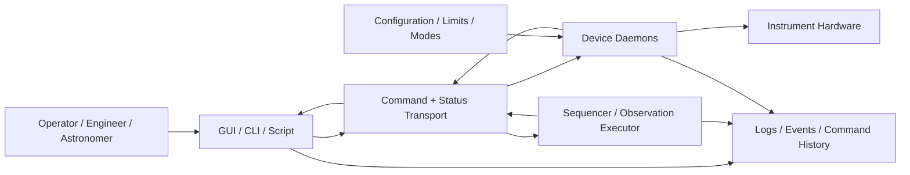
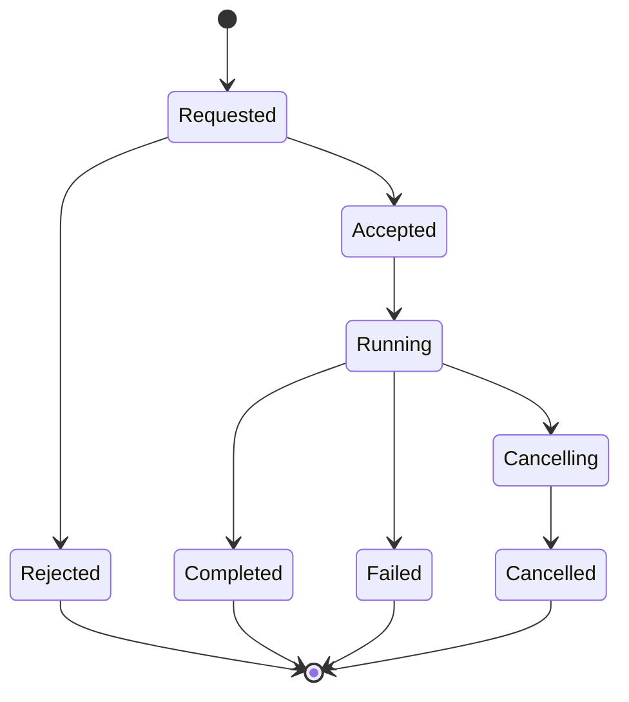

# Command-and-Control Design Specification

## 1. Purpose

This document defines a minimum command-and-control architecture for an observatory Instrument Control System (ICS).

The goal is to provide enough structure for an ICS to be:

- **Safe** — commands are validated, unsafe operations are rejected, and hardware is protected.
- **Diagnosable** — commands, state changes, failures, and recovery actions can be traced.
- **Operable** — operators and engineers can understand what the instrument is doing and why.
- **Expandable** — the design can be adapted to different instruments without requiring a redesign.

This specification is intentionally minimal. It defines the architectural spine that each instrument-specific implementation should extend.

---

## 2. Scope

This specification applies to command and control of observatory instrument software, including:

- Device daemons
- Mechanism control
- Detector and camera control
- Calibration subsystem control
- Telescope or observatory service interfaces
- Operator GUIs
- Engineering tools
- Sequencers or observation executors
- Command, status, telemetry, and event handling

This specification does not define:

- A specific programming language
- A specific messaging transport
- A complete device API for every instrument
- A science data reduction pipeline
- A complete observatory operations model

Instrument teams are expected to extend this specification with instrument-specific devices, commands, limits, modes, workflows, and safety rules.

---

## 3. Architectural Principle

The ICS shall be built around a foundational command-and-control structure.

Each controllable subsystem shall be represented by a stateful daemon that owns its hardware, validates commands, publishes status, and records command results. Higher-level clients such as GUIs, CLIs, scripts, and sequencers shall use a shared command contract rather than private or one-off control paths.


---

## 4. System Context



The specific transport may vary by project. The architecture requires that commands, command results, status, events, and logs remain consistent regardless of the selected transport.

---

## 5. Required Architectural Components

A conforming ICS design shall include the following minimum components.

### 5.1 Device Daemons

Each hardware subsystem shall be controlled by a daemon or service that owns direct interaction with that hardware.

Examples include:

- Camera daemon
- Detector daemon
- Focus daemon
- Slit daemon
- Filter daemon
- Calibration lamp daemon
- Rotator daemon
- Temperature or power daemon
- Telescope interface daemon

A device daemon shall be responsible for:

- Accepting commands for its subsystem
- Validating commands against current state and configured limits
- Executing accepted commands
- Rejecting invalid or unsafe commands
- Publishing status and telemetry
- Reporting command completion or failure
- Entering fault or safe states when required
- Logging command and state transitions

The GUI shall not directly manipulate hardware state outside the owning daemon.

---

### 5.2 Command Transport

The ICS shall provide a communication path for sending commands from clients to daemons.

Clients may include:

- Operator GUI
- Engineering GUI
- CLI tools
- Automated scripts
- Sequencer
- Test harnesses

The command transport may be implemented using the technology selected by the instrument team. However, the command transport shall support:

- Addressing a target daemon
- Sending a structured command request
- Returning command acceptance or rejection
- Associating all replies and events with a command identifier
- Reporting command completion, failure, timeout, or cancellation

---

### 5.3 Status and Event Transport

The ICS shall provide a way for daemons to publish status and events independently of command request/reply interactions.

At minimum, each daemon shall publish:

- Heartbeat
- Current daemon state
- Current mode
- Current command, if any
- Readiness state
- Fault state
- Warnings
- Key telemetry
- Last command result

Status and events shall be available to the GUI, sequencer, and engineering tools.

Status shall not exist only as GUI-local text.

---

### 5.4 Configuration and Limits

The ICS shall represent limits, modes, default values, and safety-relevant configuration as structured configuration data.

At minimum, configuration should include:

- Hardware limits
- Software limits
- Named operating modes
- Default command parameters
- Command timeouts
- Safe positions or safe states
- Calibration presets
- Engineering limits
- Observing modes

Configuration shall be inspectable and versioned where practical.

Instrument-specific implementations shall define their own configuration schema while preserving the common command-and-control model.

---

### 5.5 Command and Event Logging

The ICS shall log every command and important state transition.

At minimum, a command log entry shall include:

- Timestamp
- Command identifier
- Requester
- Target daemon
- Command name
- Command parameters
- Acceptance or rejection result
- Start time
- End time
- Final result
- Error code, if any
- Error message, if any
- Related observation or sequence identifier, if applicable

The logging system shall support post-operation diagnosis. It should be possible to determine what command was sent, who or what sent it, whether it was accepted, whether it completed, and why it failed.

---

## 6. Common Command Contract

All commands shall follow a common structural contract.

The command payload may vary by daemon, but the envelope shall be consistent across the ICS.

### 6.1 Minimum Command Request Fields

```text
command_id
command_name
target_daemon
requester
timestamp
parameters
timeout
priority_or_mode
```

### 6.2 Minimum Command Response Fields

```text
command_id
target_daemon
accepted
status
reason
error_code
message
timestamp
```

### 6.3 Minimum Command Completion Fields

```text
command_id
target_daemon
final_status
start_time
end_time
duration
result
error_code
error_message
```

### 6.4 Command Identifier Requirement

Every command shall have a unique command identifier.

The command identifier shall be used to correlate:

- Initial request
- Acceptance or rejection
- Progress events
- Status updates
- Completion result
- Failure result
- Log records

A command shall not disappear into the system without a traceable identifier.

---

## 7. Required State Models

### 7.1 Command Lifecycle

A command shall follow an explicit lifecycle.



Minimum command states:

| State | Meaning |
|---|---|
| `requested` | Command has been sent by a client. |
| `accepted` | Target daemon has accepted responsibility for the command. |
| `rejected` | Target daemon refused the command before execution. |
| `running` | Command is actively being executed. |
| `completed` | Command completed successfully. |
| `failed` | Command was accepted but did not complete successfully. |
| `cancelling` | A cancellation request is being processed. |
| `cancelled` | Command was cancelled before normal completion. |

Instrument teams may add additional states, but they shall preserve these minimum lifecycle concepts.

---

### 7.2 Daemon Lifecycle

Each daemon shall expose an explicit daemon state.

Minimum daemon states:

| State | Meaning |
|---|---|
| `offline` | Daemon is unavailable or unreachable. |
| `starting` | Daemon process has started but is not ready. |
| `initializing` | Daemon is initializing hardware or loading configuration. |
| `idle` | Daemon is available and not executing a command. |
| `busy` | Daemon is executing a command or protected operation. |
| `ready` | Daemon is ready for nominal observing operations. |
| `fault` | Daemon has detected an error that prevents normal operation. |

The exact state names may be adapted by the instrument team, but each daemon shall expose enough state for operators and higher-level software to determine whether it is available, busy, ready, faulted, or safe.

---

## 8. Safety Requirements

### 8.1 Local Safety Enforcement

Each daemon shall enforce safety rules that are local to its hardware.

Examples:

- Reject focus moves outside configured limits
- Reject slit moves outside allowed range
- Reject exposure commands when detector configuration is invalid
- Reject lamp commands when environmental or observatory conditions forbid them
- Reject motion while a protected operation is active
- Reject commands while the daemon is in fault state
- Reject commands from unauthorized clients

The GUI may perform pre-validation for user experience, but the daemon shall remain the final authority for hardware safety.

### 8.2 Safe State Behavior

Each daemon shall define what safe state means for its subsystem.

Examples:

- Stop motion
- Disable drive
- Close shutter
- Turn off lamp
- Hold current position
- Park mechanism
- Refuse additional commands except recovery commands

Instrument-specific implementations shall document safe state behavior for each daemon.

### 8.3 Fault Handling

When a daemon detects a fault, it shall:

1. Stop or inhibit unsafe activity where possible.
2. Enter a fault or safe state.
3. Publish a fault event.
4. Report the active fault in status.
5. Log the fault with enough detail for diagnosis.
6. Require an explicit recovery action if automatic recovery is unsafe.

---

## 9. Ownership and Command Authority

The ICS shall define a minimum command authority model.

Without ownership rules, GUIs, sequencers, scripts, and engineering tools can issue conflicting commands.

At minimum, the ICS shall support the following concepts:

- Read-only clients may observe but not command.
- Operator clients may issue nominal observing commands.
- Sequencer clients may own the instrument during an active sequence.
- Engineering clients may issue lower-level commands in explicit engineering mode.
- Administrative clients may change configuration or override ownership where permitted.

A daemon shall be able to reject a command if the requester does not have authority for the requested operation.

A long-running command should own the affected device until it completes, fails, or is cancelled.

Engineering mode shall be explicit and visible to operators.

---

## 10. Sequencer / Observation Executor Requirements

The ICS should include a sequencer or observation executor for multi-step workflows.

The sequencer shall use the same command contract as GUI and CLI clients.

The sequencer should coordinate workflows such as:

- Configure instrument
- Wait for telescope or observatory readiness
- Acquire target
- Configure detector
- Start exposure
- Monitor progress
- Handle readout
- Execute calibration sequence
- Move to next target
- Abort safely

The sequencer shall not rely on private control paths that bypass daemon validation, status, or logging.

---

## 11. Simulation and Test Requirements

Each daemon should support simulation or test mode.

Simulation mode should:

- Accept the same command contract as hardware mode
- Publish the same status structure as hardware mode
- Simulate successful command execution
- Simulate failures and timeouts
- Support GUI testing
- Support sequencer testing
- Support integration testing without instrument hardware

Simulation support is required to keep the ICS testable as the instrument grows.

---

## 12. Minimum Viable Implementation

A practical minimum implementation should start with one vertical slice.

```text
GUI or CLI
  -> command transport
  -> one device daemon
  -> simulated hardware
  -> status publication
  -> command/event log
```

A recommended first implementation includes:

1. One simple mechanism daemon, such as focus or filter
2. One more complex daemon, such as camera or detector
3. Shared command request and response schema
4. Shared daemon state model
5. Status publication
6. Command logging
7. Simulated hardware mode
8. Basic GUI or CLI client

This validates the architecture before expanding it to the full instrument.

---

## 13. Instrument-Specific Expansion Points

Each instrument team shall extend this minimum specification with details specific to the instrument.

Recommended expansion sections include:

### 13.1 Instrument Device Inventory

Define all daemons and controlled hardware.

Example:

| Daemon | Hardware Owned | Primary Commands | Key Status |
|---|---|---|---|
| Focus daemon | Focus stage | move, stop, home | position, state, fault |
| Camera daemon | Detector controller | configure, expose, abort | exposure state, readout state, temperature |
| Lamp daemon | Calibration lamps | enable, disable, set mode | lamp state, current, fault |

### 13.2 Instrument Modes

Define named modes such as:

- Science mode
- Acquisition mode
- Calibration mode
- Engineering mode
- Safe mode
- Maintenance mode

### 13.3 Command Catalog

Define each daemon command using a consistent template:

```text
Command name:
Target daemon:
Purpose:
Parameters:
Preconditions:
Validation rules:
Nominal behavior:
Status/events published:
Completion result:
Failure modes:
Recovery behavior:
```

### 13.4 Safety Rules

Document subsystem-specific safety rules.

Examples:

```text
The focus stage shall reject commanded positions outside configured soft limits.
The detector shall reject exposure commands unless detector configuration is complete.
The lamp daemon shall reject lamp enable commands unless the instrument is in calibration mode.
The sequencer shall not start a science exposure unless all required daemons report ready.
```

### 13.5 Operational Workflows

Define workflows such as:

- Start of night
- Configure for science target
- Acquire target
- Run exposure
- Run calibration sequence
- Pause sequence
- Abort sequence
- Recover from daemon fault
- End of night shutdown

---

## 14. Design Rules

The following rules should guide implementation decisions.

| Rule | Rationale |
|---|---|
| Hardware is owned by daemons, not GUIs. | Prevents unsafe bypass paths. |
| Commands must be traceable. | Enables diagnosis and post-operation review. |
| Status must be published independently of replies. | Enables live operations and multiple clients. |
| Safety checks belong near the hardware. | Prevents clients from becoming the only safety layer. |
| Sequencers use the same API as other clients. | Avoids private control paths. |
| Configuration should be data, not hidden code. | Enables review, versioning, and instrument-specific expansion. |
| Simulation should use the same interfaces. | Enables testing without hardware. |

---

## 15. Anti-Patterns

The following patterns should be avoided:

```text
GUI directly controls hardware
commands have no IDs
commands return only strings
status exists only as GUI text
no shared state model
no standard error model
no ownership rules
hidden safety checks in client code
no event history
sequencer uses private APIs
configuration is hardcoded
no simulator
```

These shortcuts may appear faster early in development, but they make the ICS harder to operate, diagnose, and extend.

---

## 16. Summary

This specification defines the minimum architecture needed for a safe, diagnosable, operable, and expandable observatory Instrument Control System.

The minimum architecture is not a large framework. It is a disciplined control model:

> Stateful daemons own hardware, commands follow a common contract, status is continuously published, safety is enforced locally, ownership is explicit, and every command and event is logged.

Instrument-specific implementations should extend this specification by adding concrete daemons, commands, states, limits, modes, safety rules, and operational workflows.
